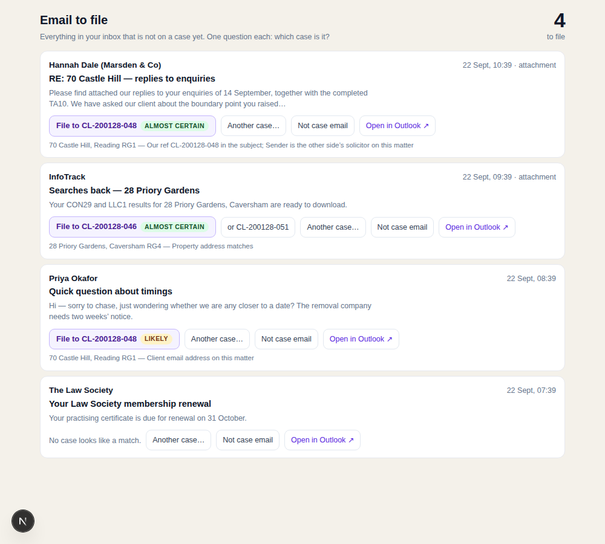

# Filing email to cases

The web app has an email view again. It is **not an inbox**, and the distinction is the
whole point.

A conveyancer already has an inbox, and it is better than anything we would build. What
they do not have is a reliable answer to "is every email on the right case?" — which is
the question that decides whether the engine can see the transaction at all. A document
attached to an unfiled thread is a document the case does not know exists.

So the view asks one question per email — **which case is this?** — and the row leaves
the moment it is answered. The list is meant to reach zero.

## What is deliberately absent

No read/unread. No folders. No reply, no forward, no archive, no delete. No search across
the mailbox. Every one of those makes it a worse inbox than Outlook and distracts from the
only job it has.

"Not case email" does **not** delete, archive or move anything. The email is the firm's,
in the firm's mailbox, and a filing tool has no business touching it. It records that
somebody looked, so the queue stops offering that thread — and deleting the row puts it
straight back.

## What is in the queue

Everything in the inbox that is not already answered for:

* threads already filed to a matter are gone (`email_thread`);
* threads someone has set aside are gone (`email_not_filed`);
* what is left carries the best matter matches we can find.

## The suggestions

Matching is **deterministic** — case reference tokens, the firm's own ref, participant
addresses, the property address, postcodes (`lib/server/matching.ts`) — and banded
`almost certain` / `likely` / `possible`. It is not AI. Scrolling a queue must never cost
a model call or burn the firm's monthly cap, which is the same rule `/api/v1/mail`
already follows.

Each row shows the top match as a one-click button with **why** it matched underneath, up
to two alternatives, and a search box for the case nobody guessed. Matching runs once per
conversation, not once per reply, so the work is proportional to threads.

## What filing actually does

It is the existing link-thread path, unchanged: the thread is linked to the matter,
categorised in Outlook with the matter's own reference so it is visibly filed there too,
and its attachments are saved into the matter — where the ordinary ingest picks them up
and the engine sees them. Filing an email is how a search result or a mortgage offer
reaches the case.

## Where it lives

**/conveyi/email**, linked from Today, the caseload and My work. Behind the sign-in wall
like every other app page.

*(The page is the real one; the mailbox behind it is sampled, because the build
environment has no Microsoft 365 connection.)*
