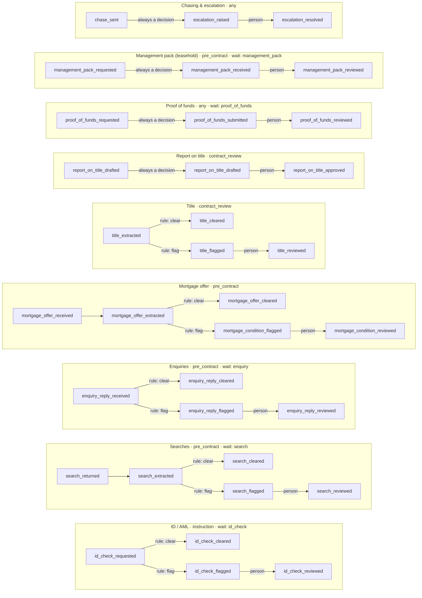
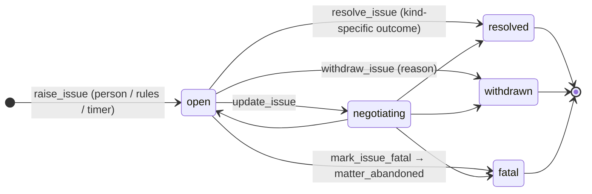

# The conveyancing state machine, generated from code

> Generated by `npm run engine:map` from `lib/server/engine/spec.ts` (`machineSpec()`), the same source the live map at `/engine/map` draws and `tests/unit/engine/spec.test.ts` checks against the machine. **Do not edit by hand** — change the machine and re-run. Spec version `8b0b11e0c1c6`.

8 stages · 9 sub-flows · 62 commands · 88 event types · 12 decision kinds · 20 triggers · 60 eventualities · 45 issue kinds · 14 workstreams.

## 0 · Case lifecycle (coarse) over the engine's phases

```mermaid
stateDiagram-v2
    direction LR
    [*] --> instructed
    state pre_exchange {
        direction LR
        pre_contract --> contract_review
        contract_review --> pre_exchange_phase
        pre_exchange_phase: pre_exchange (phase)
    }
    instructed --> pre_exchange
    pre_exchange --> ready_to_exchange: every exchange requirement satisfied (derived)
    ready_to_exchange --> exchanged: contracts_exchanged
    exchanged --> pre_completion: completion_statement_generated
    pre_completion --> completed: completion_confirmed
    completed --> post_completion: sdlt_submitted / ap1_submitted
    post_completion --> closed: ap1_confirmed then close_matter
    closed --> [*]
    instructed --> aborted: abandon_matter / mark_issue_fatal
    pre_exchange --> aborted
    ready_to_exchange --> aborted
    aborted --> [*]
```

Lifecycle states: `instructed` (Instructed) → `pre_exchange` (Pre-exchange) → `ready_to_exchange` (Ready to exchange) → `exchanged` (Exchanged) → `pre_completion` (Pre-completion) → `completed` (Completed) → `post_completion` (Post-completion) → `closed` (Closed), plus `aborted`.

## 1 · The stage spine and its gates

```mermaid
flowchart LR
    instruction["Instruction"]
    pre_contract["Pre-contract"]
    instruction -->|"ID / AML check resolved (cleared by the rule layer, or reviewed by a person)"| pre_contract
    contract_review["Contract review"]
    pre_contract -->|"every required search ordered and resolved · every enquiry replied and resolved (or withdrawn) · mortgage offer resolved (lender-funded purchases) · management pack reviewed (leasehold)"| contract_review
    pre_exchange["Pre-exchange"]
    contract_review -->|"title resolved · report on title sent (drafted → approved by a person → sent) · enquiries raised during review resolved · a re-ordered search resolved"| pre_exchange
    exchanged["Exchanged"]
    pre_exchange -->|"mortgage offer still current (not withdrawn) · no open issue holding exchange · proof of funds signed off (firm policy) · client satisfied with the physical condition where a survey is on file · client's authority to exchange (firm policy) · exchange conditions met (deposit received) · contracts exchanged"| exchanged
    pre_completion["Pre-completion"]
    exchanged -->|"completion statement generated"| pre_completion
    completed["Completed"]
    pre_completion -->|"funds received · completion payment authorised against verified seller's-solicitor details · no bank-details change pending (hard stop) · completion confirmed"| completed
    post_completion["Post-completion"]
    completed -->|"SDLT or AP1 submitted"| post_completion
    registered(["Registered"])
    closed(["Closed"])
    abandoned(["Abandoned"])
    manual(["Manual handling"])
    post_completion --> registered
    instruction -.-> abandoned
    pre_exchange -.-> abandoned
    registered --> closed
```

| Stage | Purpose | Gates to leave | Sub-flows | Typical commands |
| --- | --- | --- | --- | --- |
| `instruction` | Client instructed; identity and AML established before anything is ordered. | ID / AML check resolved (cleared by the rule layer, or reviewed by a person) | id_check | `enrol`, `request_id_check`, `mark_manual_handling` |
| `pre_contract` | Searches ordered automatically on entry; enquiries raised; the mortgage offer checked; on a leasehold purchase, the management pack reviewed. | every required search ordered and resolved; every enquiry replied and resolved (or withdrawn); mortgage offer resolved (lender-funded purchases); management pack reviewed (leasehold) | search, enquiry, mortgage | `raise_enquiry`, `record_search_ordered`, `search_returned`, `mortgage_offer_received`, `withdraw_enquiry`, `set_target_dates` |
| `contract_review` | Title reviewed; the report on title drafted by AI, approved by a person, sent. | title resolved; report on title sent (drafted → approved by a person → sent); enquiries raised during review resolved; a re-ordered search resolved | title, report_on_title | `draft_report_on_title`, `record_report_on_title_sent`, `deposit_received` |
| `pre_exchange` | Deposit in; exchange conditions derived; contracts exchanged with a completion date. | mortgage offer still current (not withdrawn); no open issue holding exchange; proof of funds signed off (firm policy); client satisfied with the physical condition where a survey is on file; client's authority to exchange (firm policy); exchange conditions met (deposit received); contracts exchanged | — | `deposit_received`, `contracts_exchanged`, `mortgage_offer_withdrawn`, `record_bank_details` |
| `exchanged` | Bound. Completion statement generated. | completion statement generated | — | `completion_statement_generated`, `change_completion_date`, `notice_to_complete_served` |
| `pre_completion` | Funds requested and received; the completion payment authorised by a person against verified bank details; completion confirmed. | funds received; completion payment authorised against verified seller's-solicitor details; no bank-details change pending (hard stop); completion confirmed | — | `funds_requested`, `funds_received`, `payment_authorised`, `completion_confirmed` |
| `completed` | SDLT within 14 days; AP1 lodged. | SDLT or AP1 submitted | — | `sdlt_submitted`, `ap1_submitted` |
| `post_completion` | Registration at HM Land Registry; requisitions answered. | HMLR requisitions answered; registration confirmed (terminal) | — | `hmlr_requisition_received`, `ap1_confirmed` |

## 2 · Sub-flows (the event pair pattern, once per sub-flow)

| Sub-flow | Rule (deterministic, never the AI) | Decision options |
| --- | --- | --- |
| **ID / AML** | Provider outcome 'clear' with no flags → clear; 'refer'/'fail', any flag, or low extraction confidence → flag. Reject halts automation. | approve · request_further · escalate · reject |
| **Searches** | Only info-severity entries → clear; any low/medium/high flag, or confidence below the threshold → flag. A resolved search may be re-ordered (new cycle). | approve · refer_to_client · request_further · indemnity · escalate |
| **Enquiries** | Reply 'answered' with no issues → clear; partial/refused/issues → flag. 'Request further' raises a tracked follow-up; a person may withdraw one. | approve · refer_to_client · request_further · escalate |
| **Mortgage offer** | Standard conditions only and expiry comfortably after the target exchange → clear; any special condition, near expiry, or low confidence → flag. Withdrawal reopens the sub-flow and blocks exchange. | approve · refer_to_client · request_further · escalate |
| **Title** | Freehold with no restrictions, charges or covenants → clear; any entry → flag with the register section cited; non-freehold tenure → manual handling. | approve · refer_to_client · request_further · indemnity · escalate |
| **Report on title** | Always a decision: the AI draft is approved or rejected by a person; it is sent only after the approval event, and the database refuses a send without one. | approve · reject · escalate |
| **Proof of funds** | Always a decision: the client's declaration is rule-checked (shortfall, unevidenced source, gift, repayable gift, higher-risk source, incomplete declarations) and briefed; the conveyancer signs off, asks for more (re-opens the form), escalates or rejects (manual handling). A round in flight holds exchange. | approve · request_further · escalate · reject |
| **Management pack (leasehold)** | Leasehold only. Always a decision: the LPE1 is a set of client-advice points (service charge, ground rent, arrears, major works, insurance). Gates pre_contract on a leasehold purchase. | approve · refer_to_client · request_further · escalate |
| **Chasing & escalation** | Working-day timers chase the party that owes us and escalate to a person with a dossier; deadlines we owe are raised once, in time. | approve · refer_to_client · escalate |

## 3 · Workstreams (the concurrent lanes the case model projects)

`id_aml` (ID / AML) · `source_of_funds` (Source of funds) · `title` (Title) · `searches` (Searches) · `enquiries` (Enquiries) · `mortgage` (Mortgage / lender) · `survey` (Survey / physical condition) · `leasehold` (Leasehold) · `contract` (Contract) · `deposit` (Deposit) · `chain` (Chain) · `report_on_title` (Report on title) · `completion` (Completion) · `registration` (Registration)

Each lane reads not started / in progress / awaiting / under review / blocked / at risk / complete from the engine state (`lib/server/engine/graph.ts → workstreams()`); the exchange, completion, registration and close gates list their requirements with the authority that satisfies each (`requirements()`).

## 4 · Commands: who may record what, and when

| Command | Actor | Stages | Emits | Description |
| --- | --- | --- | --- | --- |
| `enrol` | either | not enrolled | `matter_created` | Put a matter under the engine (lender?, required searches, target dates, counterparty type, shadow mode). |
| `mark_manual_handling` | either | any | `manual_handling_required` | Stop automation; a person runs the matter from here. |
| `request_id_check` | either | any | `id_check_requested` | Ask the ID provider (or record that the firm did). |
| `id_check_result` | automation | any | `id_check_cleared` `id_check_flagged` `auto_clear_review_raised` | The provider's report, extracted and rule-checked. |
| `record_search_ordered` | either | pre_contract, contract_review, pre_exchange, exchanged, pre_completion, completed, post_completion | `search_ordered` | A search placed (automatically on pre_contract entry, or by hand; a resolved search may be re-ordered). |
| `search_returned` | either | any | `search_returned` | The result document is back. |
| `search_extracted` | automation | any | `search_extracted` `search_cleared` `search_flagged` `auto_clear_review_raised` | Facts extracted from the result, rule-checked. |
| `raise_enquiry` | either | pre_contract, contract_review, pre_exchange, exchanged, pre_completion, completed, post_completion | `enquiry_raised` | An enquiry to the other side (external, or internal across the wall); may be raised from an open issue, which then tracks it. |
| `enquiry_reply_received` | automation | any | `enquiry_reply_received` `enquiry_reply_cleared` `enquiry_reply_flagged` `auto_clear_review_raised` | A reply document, extracted and rule-checked. |
| `mortgage_offer_received` | either | any | `mortgage_offer_received` | The offer document is on file. |
| `mortgage_offer_extracted` | automation | any | `mortgage_offer_extracted` `mortgage_offer_cleared` `mortgage_condition_flagged` `auto_clear_review_raised` | Conditions and expiry extracted, rule-checked. |
| `title_extracted` | automation | pre_contract, contract_review, pre_exchange, exchanged, pre_completion, completed, post_completion | `title_extracted` `title_cleared` `title_flagged` `auto_clear_review_raised` `manual_handling_required` | Register entries extracted, rule-checked; non-freehold halts automation. |
| `open_decision_source` | person | any | `decision_source_opened` | The handler opened the cited source (precondition of resolving). |
| `resolve_decision` | person | any | `id_check_reviewed` `search_reviewed` `enquiry_reply_reviewed` `mortgage_condition_reviewed` `title_reviewed` `report_on_title_approved` `report_on_title_rejected` `escalation_raised` `escalation_resolved` `bank_details_verified` `bank_details_verification_failed` `auto_clear_confirmed` `hmlr_requisition_responded` `enquiry_raised` `manual_handling_required` `proof_of_funds_reviewed` `management_pack_reviewed` `issue_resolved` `issue_raised` | Choose an option (with a reason unless approving); may raise a follow-up enquiry, an escalation, or halt automation. Signing off proof of funds closes the source-of-funds issues it answers and tells the lender about a gift. |
| `draft_report_on_title` | automation | contract_review | `report_on_title_drafted` | The AI drafts; the draft is a decision. |
| `set_issue_severity` | either | any | `issue_severity_changed` | Severity moved by a person, or by the timer as a deadline nears / an issue sits. |
| `survey_received` | automation | instruction, pre_contract, contract_review, pre_exchange | `survey_received` `issue_raised` | The client's survey read for its recommendations (facts); each 'further investigation' raises an issue holding exchange. |
| `specialist_report_received` | automation | instruction, pre_contract, contract_review, pre_exchange | `specialist_report_received` `issue_resolved` `issue_raised` | A specialist report read: 'no further investigation' resolves the issue (a fact); a further recommendation chains a new issue (causedBy). |
| `client_decision_recorded` | person | any | `client_decision_recorded` `issue_raised` | What only the client decides — satisfied with the physical condition, authority to exchange, accept a risk, accept terms — recorded by a person, never inferred. 'Renegotiate' raises a survey_defect issue. |
| `close_matter` | person | post_completion | `matter_closed` | File closed after registration (and, leasehold, the notice of assignment) with no open issues. |
| `request_proof_of_funds` | either | instruction, pre_contract, contract_review, pre_exchange | `proof_of_funds_requested` | Issue the tokenised proof-of-funds form and send it to the client (recorded after the send; the client wait opens). |
| `raise_proof_of_funds_query` | person | instruction, pre_contract, contract_review, pre_exchange | `proof_of_funds_query_raised` | A person adds a query to the client about a transaction or a gap (the rules draft theirs at submission). |
| `withdraw_proof_of_funds_query` | person | instruction, pre_contract, contract_review, pre_exchange | `proof_of_funds_query_withdrawn` | A drafted query is not put, with the reason on the log ('considered and discounted'). |
| `proof_of_funds_submitted` | automation | instruction, pre_contract, contract_review, pre_exchange | `proof_of_funds_query_answered` `proof_of_funds_query_raised` `proof_of_funds_submitted` | The client submitted: answers to the queries sent, statements read transaction by transaction, rule flags (declaration and transaction level) each drafting a query, the declaration document, the risk rating, and a decision for the conveyancer. |
| `management_pack_requested` | either | pre_contract, contract_review, pre_exchange, exchanged, pre_completion, completed, post_completion | `management_pack_requested` | Leasehold: the LPE1 requested from the seller's side / managing agent; the wait opens. |
| `management_pack_received` | either | any | `management_pack_received` | Leasehold: the pack arrived; always a decision citing it. |
| `notice_of_assignment_served` | either | completed, post_completion | `notice_of_assignment_served` | Leasehold: notice of assignment / charge served on the landlord after completion. |
| `record_report_on_title_sent` 🔒 | person | contract_review | `report_on_title_sent` | Sent — only after the approval event, and the database checks that too. |
| `deposit_received` | either | pre_contract, contract_review, pre_exchange, exchanged, pre_completion, completed, post_completion | `deposit_received` `exchange_conditions_met` | Deposit in; at pre_exchange this derives exchange_conditions_met. |
| `contracts_exchanged` | either | pre_exchange | `contracts_exchanged` `stage_advanced` | Exchange with a completion date; refused if the offer is withdrawn or a search is re-ordered. |
| `completion_statement_generated` | either | exchanged | `completion_statement_generated` `stage_advanced` | Statement produced (can be regenerated). |
| `record_bank_details` | either | any | `bank_details_recorded` `bank_details_change_flagged` | Bank details arrive (any channel, first time or change) → always a hard-stop decision. |
| `payment_authorised` 🔒 ⛔ | person | pre_exchange, exchanged, pre_completion, completed, post_completion | `payment_authorised` | A person authorises a payment against the newest verified record. |
| `funds_requested` 🔒 ⛔ | person | pre_completion | `funds_requested` | Ask the lender / client for completion funds into our verified client account. |
| `funds_received` | either | any | `funds_received` | Funds landed. |
| `completion_confirmed` ⛔ | either | pre_completion | `completion_confirmed` `stage_advanced` | Completed — refused while a bank-details change is pending or the payment was not authorised. |
| `sdlt_submitted` | either | completed, post_completion | `sdlt_submitted` `stage_advanced` | SDLT return filed. |
| `ap1_submitted` | either | completed, post_completion | `ap1_submitted` `stage_advanced` | AP1 lodged; opens the registration wait. |
| `ap1_confirmed` | either | any | `ap1_confirmed` | Registered (terminal). Refused while a requisition is unanswered. |
| `record_chase` | automation | any | `chase_sent` | Timer: a template chase was sent (recorded only after the send). |
| `raise_escalation` | automation | any | `escalation_raised` | Timer: a wait aged past its SLA → decision with the chase dossier. |
| `record_client_update` | automation | any | `client_update_sent` | A templated status update was sent to the client. |
| `record_suppressed` | automation | any | `action_suppressed` | Shadow mode: the intent, not the action. |
| `set_shadow_mode` | person | any | `shadow_mode_changed` | Admin switches shadow mode. |
| `abandon_matter` | person | any | `matter_abandoned` | Abortive: client withdrew, chain collapsed, gazumped… Waits close, timers stop, only corrections may follow. |
| `set_target_dates` | either | instruction, pre_contract, contract_review, pre_exchange | `target_dates_changed` | Re-plan target exchange / completion before exchange. |
| `change_completion_date` | either | exchanged, pre_completion | `completion_date_changed` | Move the contractual completion date after exchange. |
| `notice_to_complete_served` | either | exchanged, pre_completion | `notice_to_complete_served` | Either side served notice: a decision citing the notice; the timer raises the deadline. |
| `mortgage_offer_withdrawn` | either | pre_contract, contract_review, pre_exchange | `mortgage_offer_withdrawn` | Offer withdrawn / lapsed before exchange: sub-flow reopens, exchange blocked. |
| `withdraw_enquiry` | either | any | `enquiry_withdrawn` | An enquiry no longer needed (indemnity, superseded). |
| `hmlr_requisition_received` | either | post_completion | `hmlr_requisition_received` | HMLR requisition → decision citing the letter; blocks registration until answered. |
| `record_correction` | person | any | `correction_recorded` | The log is never edited: a compensating record against a wrong event (allowed after abandonment). |
| `record_handler_change` | either | any | `handler_changed` | Reassignment / holiday cover on the log. |
| `raise_deadline_escalation` | automation | any | `escalation_raised` | Timer: a deadline we owe (offer expiry, SDLT, notice to complete, requisition reply) or a stale issue, raised once, in time. |
| `raise_issue` | either | instruction, pre_contract, contract_review, pre_exchange, exchanged, pre_completion | `issue_raised` | Something is wrong (survey defect, down-valuation, missing building regs, chain, probate, gifted deposit…): a typed issue with a gate (holds exchange / completion / nothing). |
| `update_issue` | either | instruction, pre_contract, contract_review, pre_exchange, exchanged, pre_completion | `issue_updated` | Progress: negotiating, a note, or a gate change (releasing a hold needs a note). |
| `resolve_issue` | person | instruction, pre_contract, contract_review, pre_exchange, exchanged, pre_completion | `issue_resolved` `price_changed` `issue_raised` `mortgage_offer_withdrawn` | Resolved with one of the kind's realistic outcomes. A price reduction records price_changed; a price change / indemnity / retention on a lender-funded purchase raises a lender_approval issue; a new lender reopens the mortgage sub-flow. |
| `withdraw_issue` | either | instruction, pre_contract, contract_review, pre_exchange, exchanged, pre_completion | `issue_withdrawn` | Raised in error / overtaken. |
| `mark_issue_fatal` | person | instruction, pre_contract, contract_review, pre_exchange, exchanged, pre_completion | `issue_fatal` `matter_abandoned` | The issue ended the transaction: fatal + abandoned in one command, with the abandonment reason derived from the kind. |
| `record_price_change` | either | instruction, pre_contract, contract_review, pre_exchange | `price_changed` `issue_raised` | The agreed price (first record) or a renegotiated price before exchange; a change on a lender-funded purchase raises a lender_approval issue. |
| `contract_approved` | either | contract_review, pre_exchange | `contract_approved` | Readiness milestone: the draft contract is approved as to form (advisory). |
| `signed_contract_held` | either | contract_review, pre_exchange | `signed_contract_held` | Readiness milestone: the client's signed contract is on file (advisory). |

🔒 human-gated at the database (automation cannot write it). ⛔ hard stop while a bank-details decision is pending.

## 5 · Event types

- **lifecycle**: `matter_created`, `stage_advanced`, `manual_handling_required`, `deposit_received`, `exchange_conditions_met`, `contracts_exchanged`, `completion_statement_generated`, `completion_confirmed`, `sdlt_submitted`, `ap1_submitted`, `ap1_confirmed`
- **id_check**: `id_check_requested`, `id_check_cleared`, `id_check_flagged` (decision), `id_check_reviewed`
- **search**: `search_ordered`, `search_returned`, `search_extracted`, `search_cleared`, `search_flagged` (decision), `search_reviewed`
- **enquiry**: `enquiry_raised`, `enquiry_reply_received`, `enquiry_reply_cleared`, `enquiry_reply_flagged` (decision), `enquiry_reply_reviewed`, `enquiry_withdrawn`
- **mortgage**: `mortgage_offer_received`, `mortgage_offer_extracted`, `mortgage_offer_cleared`, `mortgage_condition_flagged` (decision), `mortgage_condition_reviewed`, `mortgage_offer_withdrawn`
- **title**: `title_extracted`, `title_cleared`, `title_flagged` (decision), `title_reviewed`
- **report_on_title**: `report_on_title_drafted` (decision), `report_on_title_approved`, `report_on_title_rejected`, `report_on_title_sent` 🔒
- **payments**: `funds_requested` 🔒, `funds_received`, `bank_details_recorded`, `bank_details_change_flagged` (decision), `bank_details_verified`, `bank_details_verification_failed`, `payment_authorised` 🔒
- **timers & comms**: `client_update_sent`, `chase_sent`, `escalation_raised` (decision), `escalation_resolved`
- **decisions**: `decision_source_opened`, `auto_clear_review_raised` (decision), `auto_clear_confirmed`
- **shadow**: `action_suppressed`, `shadow_mode_changed`
- **eventualities**: `matter_abandoned`, `target_dates_changed`, `completion_date_changed`, `notice_to_complete_served` (decision), `hmlr_requisition_received` (decision), `hmlr_requisition_responded`, `correction_recorded`, `handler_changed`
- **issues**: `issue_raised`, `issue_updated`, `issue_resolved`, `issue_withdrawn`, `issue_fatal`, `price_changed`, `contract_approved`, `signed_contract_held`, `issue_severity_changed`
- **proof_of_funds**: `proof_of_funds_requested`, `proof_of_funds_submitted` (decision), `proof_of_funds_reviewed`, `proof_of_funds_query_raised`, `proof_of_funds_query_withdrawn`, `proof_of_funds_query_answered`
- **leasehold**: `management_pack_requested`, `management_pack_received` (decision), `management_pack_reviewed`, `notice_of_assignment_served`
- **case model**: `survey_received`, `specialist_report_received`, `client_decision_recorded`, `matter_closed`

## 6 · Time as a trigger

| Wait | Chase after | Then every | Escalate after | Re-escalate after | Recipient |
| --- | --- | --- | --- | --- | --- |
| `search` | 10 wd | 3 wd | 18 wd | 5 wd | search_provider |
| `enquiry` | 5 wd | 3 wd | 15 wd | 5 wd | seller_solicitor |
| `id_check` | 3 wd | 2 wd | 7 wd | 3 wd | client |
| `funds` | 2 wd | 1 wd | 4 wd | 2 wd | lender |
| `registration` | 30 wd | 10 wd | 60 wd | 20 wd | hmlr |
| `proof_of_funds` | 3 wd | 3 wd | 10 wd | 5 wd | client |
| `management_pack` | 10 wd | 5 wd | 20 wd | 5 wd | seller_solicitor |

| Deadline | Raised | About |
| --- | --- | --- |
| `mortgage_offer_expiry` | 15 working days before | offer expiry before exchange |
| `sdlt_filing` | 5 working days before | 14 days from completion |
| `notice_to_complete` | 2 working days before | notice expiry |
| `requisition_reply` | 5 working days before | HMLR reply-by date |
| `stale_issue` | 10 working days without movement | an open issue with no movement (working days since last touched) |

Timed issues (`sla.ts → timedIssueActions`): mortgage offer VALID → EXPIRING (30 days, warning) → CRITICAL (14 days) → EXPIRED (offer withdrawn, critical issue); a search / enquiry past its escalation point becomes an informational issue the timer also closes; an open issue past its kind's escalation period goes up a severity.

## 7 · Issues: what goes wrong, what it holds, the ways out

| Kind | Group | Holds | Severity | Workstreams | Threatens | Owner | Escalates after | Resolutions |
| --- | --- | --- | --- | --- | --- | --- | --- | --- |
| **Title defect / discrepancy** `title_defect` | Title | exchange | warning | title | exchange, registration | conveyancer | 10 wd | indemnity_policy, deed_or_declaration, evidence_provided, document_reexecuted, accepted_as_is, other |
| **Restriction on title** `title_restriction` | Title | exchange | warning | title | exchange, registration | seller_side | 10 wd | restriction_complied, consent_obtained, deed_or_declaration, indemnity_policy, accepted_as_is, other |
| **Missing easement / right** `missing_easement` | Title | exchange | warning | title | exchange | conveyancer | 10 wd | deed_or_declaration, indemnity_policy, evidence_provided, accepted_as_is, other |
| **Restrictive covenant** `restrictive_covenant` | Title | exchange | warning | title | exchange | conveyancer | 10 wd | indemnity_policy, retrospective_consent, deed_of_variation, accepted_as_is, other |
| **Boundary discrepancy** `boundary_discrepancy` | Title | exchange | warning | title, survey | exchange | conveyancer | 10 wd | deed_or_declaration, evidence_provided, indemnity_policy, price_reduced, accepted_as_is, other |
| **Missing consent** `missing_consent` | Title | exchange | warning | title, leasehold | exchange | conveyancer | 10 wd | consent_obtained, retrospective_consent, indemnity_policy, accepted_as_is, other |
| **Lease defect** `lease_defect` | Leasehold | exchange | warning | leasehold, title | exchange | conveyancer | 10 wd | deed_of_variation, indemnity_policy, lender_confirmed, accepted_as_is, other |
| **Short lease** `short_lease` | Leasehold | exchange | critical | leasehold, mortgage | exchange | conveyancer | 10 wd | lease_extended, price_reduced, new_lender, lender_confirmed, accepted_as_is, other |
| **Service charge issue** `service_charge_issue` | Leasehold | exchange | warning | leasehold | exchange | seller_side | 10 wd | retention_agreed, price_reduced, evidence_provided, accepted_as_is, other |
| **Ground rent issue** `ground_rent_issue` | Leasehold | exchange | warning | leasehold, mortgage | exchange | conveyancer | 10 wd | deed_of_variation, indemnity_policy, lender_confirmed, price_reduced, accepted_as_is, other |
| **Freeholder / managing-agent information outstanding** `freeholder_info_outstanding` | Leasehold | exchange | warning | leasehold | exchange | seller_side | 10 wd | received, accepted_as_is, other |
| **Planning permission missing** `planning_permission_missing` | Planning & building regs | exchange | warning | searches, title | exchange | conveyancer | 10 wd | indemnity_policy, retrospective_consent, evidence_provided, works_before_exchange, price_reduced, accepted_as_is, other |
| **Building-regs approval missing** `building_regs_missing` | Planning & building regs | exchange | warning | searches, survey | exchange | seller_side | 10 wd | indemnity_policy, regularisation_certificate, evidence_provided, retention_agreed, price_reduced, accepted_as_is, other |
| **Search adverse entry** `search_adverse_entry` | Searches | exchange | warning | searches | exchange | conveyancer | 10 wd | evidence_provided, specialist_report_clear, indemnity_policy, lender_confirmed, price_reduced, accepted_as_is, other |
| **Search delayed** `search_delayed` | Searches | none | info | searches | exchange | third_party | 5 wd | received, indemnity_policy, dates_replanned, accepted_as_is, other |
| **Enquiry unanswered** `enquiry_unanswered` | Enquiries | none | info | enquiries | exchange | seller_side | 5 wd | received, accepted_as_is, other |
| **Unsatisfactory enquiry response** `enquiry_unsatisfactory` | Enquiries | exchange | warning | enquiries | exchange | conveyancer | 10 wd | received, evidence_provided, indemnity_policy, price_reduced, accepted_as_is, other |
| **Source-of-funds evidence outstanding** `source_of_funds` | Source of funds & AML | exchange | warning | source_of_funds | exchange | client | 5 wd | evidence_provided, other |
| **AML / KYC problem** `aml_kyc_problem` | Source of funds & AML | exchange | critical | id_aml | exchange | mlro | 5 wd | evidence_provided, accepted_as_is, other |
| **Mortgage offer outstanding** `mortgage_offer_outstanding` | Mortgage | exchange | warning | mortgage | exchange | client | 5 wd | received, new_lender, dates_replanned, other |
| **Mortgage condition outstanding** `mortgage_condition_outstanding` | Mortgage | exchange | warning | mortgage | exchange, completion | conveyancer | 5 wd | condition_satisfied, retention_agreed, lender_confirmed, evidence_provided, other |
| **Mortgage offer expiring** `mortgage_offer_expiring` | Mortgage | none | warning | mortgage | exchange, completion | client | 3 wd | offer_extended, received, dates_replanned, new_lender, other |
| **Mortgage offer expired** `mortgage_offer_expired` | Mortgage | exchange | critical | mortgage | exchange, completion | client | 3 wd | received, new_lender, other |
| **Valuation issue** `valuation_issue` | Mortgage | exchange | warning | mortgage, survey | exchange | client | 5 wd | price_reduced, buyer_covers_shortfall, new_lender, revaluation_upheld, specialist_report_clear, retention_agreed, accepted_as_is, other |
| **Lender approval needed** `lender_approval` | Mortgage | exchange | warning | mortgage | exchange | lender | 5 wd | lender_confirmed, new_lender, other |
| **Deposit issue** `deposit_issue` | Deposit & completion money | exchange | warning | deposit | exchange | client | 5 wd | deposit_agreed, funds_in_place, evidence_provided, other |
| **Completion funds shortfall** `completion_funds_shortfall` | Deposit & completion money | completion | critical | completion, deposit | completion | client | 2 wd | funds_in_place, evidence_provided, other |
| **Lender funds delayed** `lender_funds_delayed` | Deposit & completion money | completion | critical | completion, mortgage | completion | lender | 1 wd | received, completed_late, other |
| **Chain dependency** `chain_dependency` | Parties & chain | exchange | warning | chain | exchange, completion | third_party | 5 wd | chain_ready, dates_replanned, other |
| **Seller delay** `seller_delay` | Parties & chain | exchange | info | chain, enquiries | exchange | seller_side | 5 wd | received, dates_replanned, accepted_as_is, other |
| **Buyer delay** `buyer_delay` | Parties & chain | exchange | info | chain | exchange | client | 5 wd | received, dates_replanned, other |
| **Third-party consent required** `third_party_consent` | Parties & chain | exchange | warning | leasehold, title | exchange | third_party | 10 wd | consent_obtained, accepted_as_is, other |
| **Document execution problem** `document_execution_problem` | Parties & chain | exchange | warning | contract | exchange, completion, registration | client | 3 wd | document_reexecuted, evidence_provided, other |
| **Occupier consent required** `occupier_consent` | Parties & chain | exchange | warning | mortgage | exchange | client | 5 wd | consent_obtained, condition_satisfied, other |
| **Probate issue** `probate_issue` | Parties & chain | exchange | warning | chain, title | exchange | seller_side | 15 wd | grant_obtained, evidence_provided, other |
| **Power-of-attorney issue** `power_of_attorney_issue` | Parties & chain | exchange | warning | title, id_aml | exchange, registration | seller_side | 10 wd | attorney_verified, evidence_provided, other |
| **Bankruptcy / insolvency issue** `bankruptcy_insolvency` | Parties & chain | exchange | critical | id_aml, title | exchange | conveyancer | 5 wd | insolvency_cleared, evidence_provided, other |
| **Survey defect** `survey_defect` | The property itself | exchange | warning | survey | exchange | client | 5 wd | price_reduced, works_before_exchange, retention_agreed, specialist_report_clear, accepted_as_is, other |
| **Environmental risk** `environmental_risk` | The property itself | exchange | warning | searches | exchange | conveyancer | 10 wd | evidence_provided, lender_confirmed, specialist_report_clear, price_reduced, accepted_as_is, other |
| **Third-party arrangement** `third_party_encumbrance` | The property itself | exchange | warning | title, searches | exchange | conveyancer | 10 wd | evidence_provided, lender_confirmed, works_before_exchange, indemnity_policy, accepted_as_is, other |
| **Document missing** `document_missing` | The property itself | exchange | info | enquiries | exchange | seller_side | 10 wd | received, evidence_provided, indemnity_policy, accepted_as_is, other |
| **Disclosure concern** `disclosure_concern` | The property itself | exchange | warning | enquiries | exchange | conveyancer | 5 wd | evidence_provided, price_reduced, accepted_as_is, other |
| **Completion failure** `completion_failure` | Completion | completion | critical | completion | completion | conveyancer | 1 wd | completed_late, funds_in_place, other |
| **Further investigation recommended** `survey_further_investigation` | The property itself | exchange | warning | survey | exchange | client | 10 wd | specialist_report_clear, accepted_as_is, price_reduced, retention_agreed, works_before_exchange, other |
| **Other** `other` | Other | exchange | warning | — | exchange | conveyancer | — | price_reduced, buyer_covers_shortfall, retention_agreed, works_before_exchange, indemnity_policy, regularisation_certificate, retrospective_consent, consent_obtained, specialist_report_clear, evidence_provided, deed_or_declaration, deed_of_variation, lease_extended, restriction_complied, document_reexecuted, received, offer_extended, condition_satisfied, new_lender, revaluation_upheld, lender_confirmed, chain_ready, grant_obtained, attorney_verified, insolvency_cleared, deposit_agreed, funds_in_place, completed_late, dates_replanned, accepted_as_is, other |

| Resolution | Effect on the rest of the machine |
| --- | --- |
| `price_reduced` | records price_changed (new price required, before exchange only); lender-funded purchase: raises a lender_approval issue holding exchange |
| `retention_agreed` | lender-funded purchase: raises a lender_approval issue holding exchange |
| `indemnity_policy` | lender-funded purchase: raises a lender_approval issue holding exchange |
| `new_lender` | lender-funded purchase: records mortgage_offer_withdrawn (the sub-flow reopens) |

## 8 · Client decisions (recorded by a person, never inferred)

- `physical_condition`: satisfied / renegotiate / further_investigation / withdraw
- `exchange_authority`: authorised / not_yet / withdrawn
- `accept_risk`: accepted / declined
- `accept_terms`: accepted / declined
- `completion_date`: agreed / declined

## 9 · Decision kinds

| Kind | Options | Source the person must open |
| --- | --- | --- |
| `id_check` | approve · request_further · escalate · reject | ID / AML |
| `search` | approve · refer_to_client · request_further · indemnity · escalate | Searches |
| `enquiry` | approve · refer_to_client · request_further · escalate | Enquiries |
| `mortgage` | approve · refer_to_client · request_further · escalate | Mortgage offer |
| `title` | approve · refer_to_client · request_further · indemnity · escalate | Title |
| `report_on_title` | approve · reject · escalate | Report on title |
| `escalation` | approve · refer_to_client · escalate | Chasing & escalation |
| `bank_details` | verify · reject · escalate | the document the details arrived on |
| `auto_clear` | approve · escalate | the auto-cleared document |
| `requisition` | approve · escalate | the HMLR requisition letter |
| `proof_of_funds` | approve · request_further · escalate · reject | Proof of funds |
| `management_pack` | approve · refer_to_client · request_further · escalate | Management pack (leasehold) |

## 10 · Triggers: every door into the engine

| Trigger | Backend | Source | Feeds | Reaches | Built |
| --- | --- | --- | --- | --- | --- |
| Email attachment filed to the matter | native | email | ingest | search, enquiry, mortgage, title, id_check | yes |
| File dropped in the matter folder (OneDrive) | native | file | ingest | search, enquiry, mortgage, title, id_check | yes |
| Upload from the engine panel | native | user | ingest | search, enquiry, mortgage, title, id_check | yes |
| File an existing document with an explicit role | native | user | ingest | search, enquiry, mortgage, title, id_check | yes |
| InfoTrack result returned | both | provider | ingest | search, title, id_check | yes |
| Client message (WhatsApp) | native | messaging | comms | — | yes |
| A person records what happened | both | user | command | USER_COMMANDS | yes |
| Client submits the proof-of-funds form | both | user | command | proof_of_funds_submitted | yes |
| Decision resolved in the panel | both | user | command | resolve_decision | yes |
| Working-day timer sweep | both | timer | command | record_chase, raise_escalation, raise_deadline_escalation | yes |
| Outlook add-in taskpane | native | user | command | resolve_decision | yes |
| Matter reassigned in the app | native | user | command | record_handler_change | yes |
| Document filed in LEAP | leap | webhook | ingest | search, enquiry, mortgage, title, id_check | yes |
| Matter created / updated / closed in LEAP | leap | webhook | sync | enrol, record_handler_change, set_target_dates | yes |
| Card (party) updated in LEAP | leap | webhook | sync | — | yes |
| Polling sync — matters | leap | poll | sync | enrol | yes |
| Polling sync — documents on every enrolled matter | leap | poll | ingest | search, enquiry, mortgage, title, id_check | yes |
| CONVEYi task ticked off in LEAP | leap | webhook | command | — | planned |
| Key date changed in LEAP (exchange / completion) | leap | webhook | command | set_target_dates, change_completion_date | planned |
| Email / letter filed to the LEAP matter | leap | webhook | ingest | enquiry, record_bank_details | planned |

## 11 · Invariants the machine enforces

- **Replayable** — project(log) reproduces the live state exactly; the audit verifies the hash chain and the replay. _(projection.ts, audit.ts, engine-audit CLI)_
- **Every decision cites a source** — A decision event without a document, a summary, a citation or an option is refused before it is written. _(machine.ts assertDecisionSpec)_
- **Source before verdict** — Resolving needs decision_source_opened by the same person and scroll/dwell engagement; the server refuses (412) without both. _(machine.ts, decisions/[eventId]/resolve)_
- **A reason for anything but approve** — Non-approve options need a written reason stored on the resolving event. _(machine.ts)_
- **No payment or send by automation** — funds_requested, payment_authorised and report_on_title_sent need a human approver; the database trigger refuses otherwise, and the automation role cannot write them at all. _(migration 071 trigger + policy, runAsAutomation)_
- **Bank details are a hard stop** — Every set or change is a decision resolved only by out-of-band verification; payments are refused (423) while one is pending or against a superseded record. _(machine.ts assertPayableDetails, migration 070 trigger)_
- **Two kinds of transition only** — Actor is system, ai, external or a user id; anything ambiguous becomes a decision. _(types.ts Actor, machine.ts)_
- **Walled counterparties** — Internally-linked matters are separated by row-level security; the same enquiry event pair is used across the wall. _(migrations 068–069, counterparty.ts)_
- **Shadow before live** — A shadow matter or sub-flow is logged, never surfaced, never sent; conclusions are compared with the human record before promotion. _(service.ts suppressed(), store.ts surfacedDecisions)_
- **The log only says what happened** — I/O is recorded after it succeeded; a result that arrives for a step nobody started records the start first (actor external); errors are corrections, never edits. _(service.ts, sync.ts routeByHint, record_correction)_
- **Abandoned is final** — After matter_abandoned nothing moves: waits close, timers stop, commands are refused, only corrections are accepted. _(machine.ts requireEnrolled)_
- **An open issue holds its gate** — An open or negotiating issue gated on exchange blocks exchange_conditions_met, contracts_exchanged and the pre_exchange exit; one gated on completion blocks completion_confirmed. Everything else proceeds ('everything but exchange can go on'). Releasing a hold needs a note. _(machine.ts issuesGating, stageBlockers)_
- **Facts are automated, judgements are routed** — The machine records objective facts from documents (a report arrived, it recommends further investigation, a specialist finds nothing) and never infers a judgement: title / enquiries / AML satisfactory are a conveyancer's decision; satisfied with the property, accept a risk, authority to exchange are the client's, recorded by a person from their instruction. _(machine.ts client_decision_recorded (person only), verdictEvents (decisions always human), graph.ts requirement authority)_
- **Source of funds is scrutinised, not filed** — Every attached statement is read transaction by transaction; every unusual credit drafts a query; sign-off is refused while a query is open (send it, or withdraw it with a reason); a round in flight — and, by firm policy, an unsigned-off check — holds exchange; money accepted before sign-off raises an issue; a price rise beyond the verified funds re-opens the question. _(proof-of-funds.ts reviewTransactions, machine.ts proofOfFundsHolds, resolveEvents)_
- **The lender is told** — On a lender-funded purchase a price change, an indemnity policy or a retention automatically raises a lender_approval issue that holds exchange until the lender confirms. _(machine.ts lenderApprovalIssue)_

## 12 · Eventualities

| Area | Scenario | Handling | Mechanism |
| --- | --- | --- | --- |
| shape | Cash purchase | built | hasLender=false → no mortgage sub-flow, no lender funds |
| shape | Mortgage purchase | built | offer sub-flow; expiry deadline; withdrawal reopens and blocks exchange |
| shape | Chain | built | issue chain_not_ready holds exchange; set_target_dates; mark_issue_fatal → abandoned(chain_collapsed) |
| shape | Two or more buyers | built | issues carry the party they concern; one ID sub-flow per matter still (design: idChecks keyed by party) |
| shape | Company buyer / buy-to-let | manual | mark_manual_handling by policy |
| shape | Gifted deposit / source of funds | built | proof-of-funds form → statements read line by line → flags draft queries → client answers → sign-off decision; sign-off closes source_of_funds issues and tells the lender of a gift |
| shape | Unusual transactions on a statement (cash, third party, crypto, gambling, overseas, in-and-out) | built | reviewTransactions flags each line and drafts the query; QUERY_UNANSWERED keeps it open; risk rating enhanced |
| exchange | Deposit received before source of funds signed off | built | issue aml_kyc_problem raised automatically, holds exchange |
| pre_contract | Price rises beyond the verified funds | built | issue source_of_funds raised automatically on price_changed |
| shape | Help to Buy / Lifetime ISA | gap | design: funds_requested fromRole isa_provider |
| shape | New build / auction | manual | out of v1 scope |
| shape | Leasehold | built | leasehold_purchase: management-pack sub-flow gates pre_contract; lease facts (short lease, ground rent, doubling) flagged on title; notice of assignment after completion; a tenure that does not match the enrolment halts automation |
| shape | Internal counterparty | built | ethical wall; same event pair |
| instruction | ID check refer / fail | built | id_check decision; reject halts automation |
| instruction | ID result ordered outside the engine | built | request recorded first, actor external |
| instruction | Conflict | built | abandon_matter(conflict); same-handler links refused at the DB |
| instruction | Handler change | built | record_handler_change |
| pre_contract | Search flags something | built | approve / refer / request further / indemnity / escalate |
| pre_contract | Search unreadable | built | confidence < threshold → flagged, never guessed |
| pre_contract | Search re-issued / lender freshness rule | built | re-order a resolved search → new cycle; gates exchange again |
| pre_contract | Search never returns / provider down | built | search wait timers; manual order fallback |
| pre_contract | Extra search types | gap | design: tenant-extensible requiredSearches |
| pre_contract | Partial / evasive replies | built | request further → tracked follow-up |
| pre_contract | Seller refuses to answer | built | withdraw_enquiry or abandon |
| pre_contract | Reply cannot be matched to one enquiry | built | not guessed; reported to a person to file |
| pre_contract | Special conditions / retention | built | mortgage decision |
| pre_contract | Offer expiry near exchange | built | flag at extraction + deadline timer 15 wd out |
| pre_contract | Offer withdrawn / lender change | built | mortgage_offer_withdrawn; new offer judged afresh |
| pre_contract | Cash ↔ mortgage change | gap | design: lender_status_changed |
| pre_contract | Price renegotiated | built | resolve_issue(price_reduced) or record_price_change → price_changed; lender_approval issue on a lender-funded purchase |
| pre_contract | Survey finds a defect | built | issue survey_defect → price reduced / works / retention / specialist report / accepted |
| pre_contract | Down-valuation | built | issue valuation_shortfall → price reduced / buyer covers / new lender (reopens the offer) / challenge |
| pre_contract | Missing building regs / FENSA / planning | built | issues missing_building_regs, planning_breach, document_missing → indemnity (lender told) / regularisation / retrospective consent |
| pre_contract | Probate not granted / attorney / capacity | built | issue seller_capacity holds exchange; everything else proceeds |
| pre_contract | Solar lease / septic tank / unadopted road | built | issues third_party_encumbrance, access_rights → evidence / lender confirmed / indemnity |
| pre_contract | Issue goes quiet for weeks | built | stale_issue timer: escalation after 10 working days without movement |
| contract_review | Restriction / charge / covenant | built | title decision incl. indemnity (lender_approval issue on a lender-funded purchase); issues covenant_consent, title_defect |
| contract_review | Ready to exchange? | built | readiness milestones contract_approved, signed_contract_held (advisory) + stage blockers |
| contract_review | New information after the report went | manual | title re-extraction refused after send |
| contract_review | Draft rejected | built | report_on_title_rejected → redraft |
| exchange | Simultaneous exchange and completion | built | exchange with completionDate = today |
| exchange | Exchange deferred | built | set_target_dates |
| exchange | Gazumped / withdrawn / chain collapse | built | abandon_matter |
| exchange | Deposit late / short | built | issue funding_shortfall → funds_in_place |
| exchange | Issue proves fatal | built | mark_issue_fatal → issue_fatal + matter_abandoned |
| completion | Completion date moved | built | change_completion_date |
| completion | Notice to complete | built | decision + deadline timer 2 wd out |
| completion | Lender funds late | built | funds wait timers |
| completion | Client balance short | built | issue funding_shortfall (gate completion) → funds_in_place |
| completion | Completion fails on the day | built | issue completion_failure holds completion_confirmed → completed_late / funds_in_place; notice to complete if it slips |
| completion | Bank details 'change' | built | addendum 2 hard stop |
| post_completion | SDLT within 14 days | built | deadline timer 5 wd out |
| post_completion | HMLR requisition | built | requisition decision; blocks ap1_confirmed; deadline timer |
| post_completion | Registration slow | built | registration wait timers |
| post_completion | OS1 priority expiring | gap | design: priority_search_made(expiresAt) |
| cross | Documents in any order | built | PENDING ingest retry |
| cross | Duplicate / re-issued document | built | idempotent on provider id; re-issue = new cycle |
| cross | Something recorded in error | built | record_correction (compensating, never an edit) |
| cross | Bank holidays | built | E&W working-day calendar |
| cross | Two backends (LEAP / own app) | built | CaseBackend abstraction |

_lib/server/engine/spec.ts (checked against machine.ts, types.ts, rules.ts, sla.ts, triggers.ts by tests/unit/engine/spec.test.ts)_