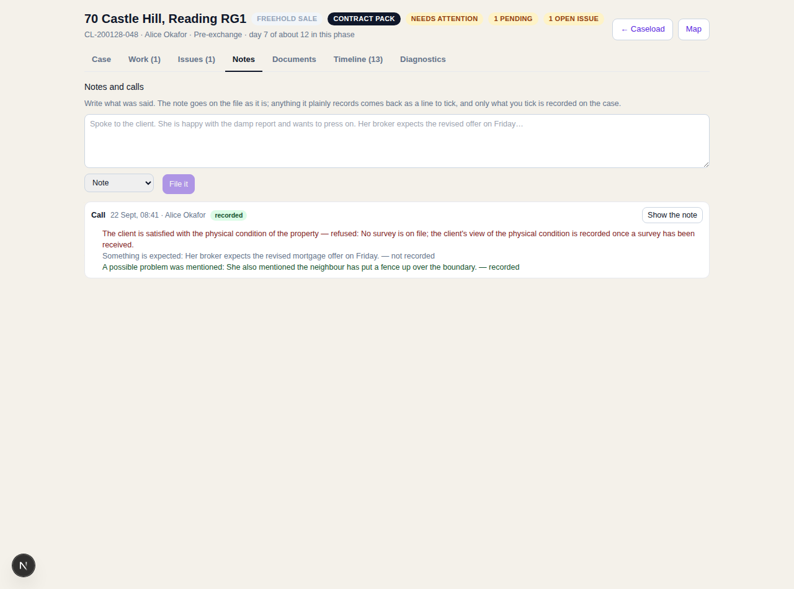
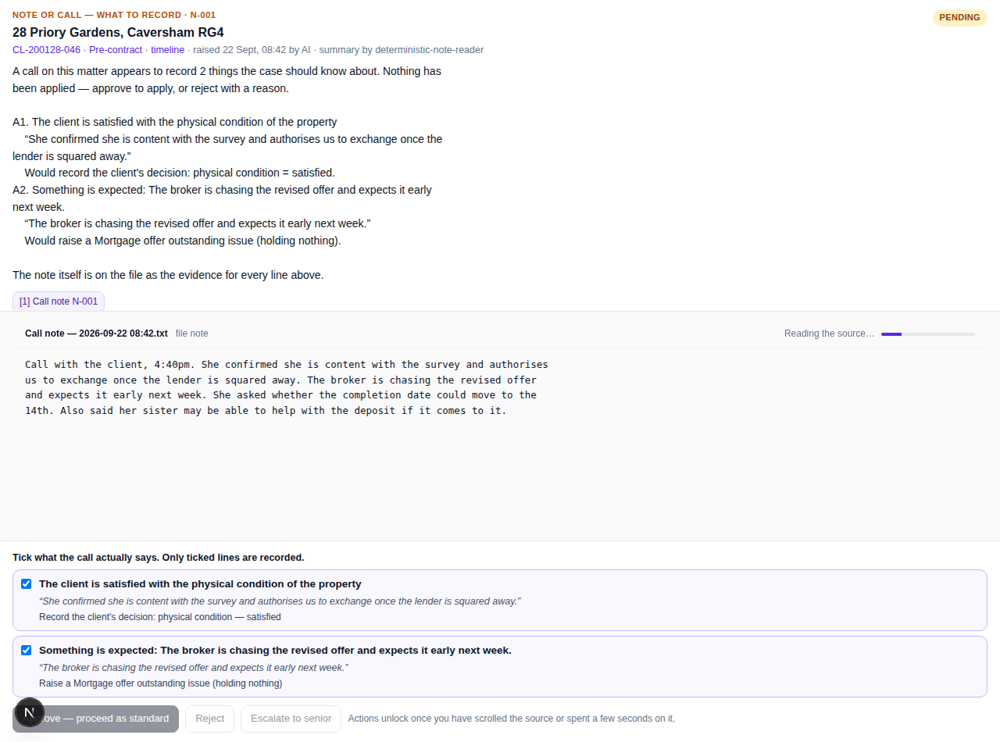

# Notes, calls and transcripts → events

A conveyancer rings a client on a Tuesday afternoon. The client says she is happy with the
damp report and wants to press on; her broker expects the revised offer on Friday; and,
almost in passing, the neighbour has put a fence up over the boundary.

Today that conversation lives in somebody's memory and, at best, a file note nobody
re-reads. The case does not know the client has made a decision. Nothing is chasing the
offer. The boundary point surfaces six weeks later, at the worst possible moment.

This is the part of the system that fixes that — without letting a transcript run the file.

## The rule the whole thing rests on

> **A note can never put something into the case that a person could not have typed
> themselves.**

Everything below is machinery for enforcing that rule.

## The shape

```
note or transcript
      │  record_note        (a person; the note is evidence the moment it lands)
      ▼
  note_recorded ──────────────────────────────────────────────► on the file, forever
      │  note_extracted     (the reader — a model, or the deterministic fallback)
      ▼
  proposals, each one:
      • quoting the note verbatim, or it is dropped
      • naming exactly ONE command the machine already accepts, or it is dropped
      ▼
  ONE decision (kind `note_actions`) for a person
      │  resolve_decision, with a per-line selection
      ▼
  note_actions_applied ──► the service runs each chosen command through the
                           machine's ordinary front door, as the approver
      │
      └─ anything the machine then refuses → note_action_refused
```

Two steps, not one, on purpose. The note is on the log as evidence even if the reading
fails, the model is unavailable, or there is no extractor configured at all. Losing the
reading must never lose the note.

## What a proposal has to survive

`validateNoteActions` in `lib/server/engine/notes.ts` drops anything that fails:

1. **It must quote the note.** The quote is matched against the note's own words, ignoring
   whitespace and curly quotes — but not paraphrase. A reader that invents an instruction
   nobody gave cannot point at the sentence that gave it, so the line disappears.
2. **It must name a command the machine accepts.** A `client_decision_recorded` with an
   outcome that subject does not have, or a `raise_issue` with an invented kind, is
   refused here — before a person ever sees it. The command set is the same one the
   dashboard uses; there is no note-only side door.
3. **It must not be a duplicate** of a line already kept.

Everything that survives is an `information` line at worst: summarised, quoted, and
recording nothing.

## Why one decision and not one per line

A call is one event in the conveyancer's day. Five decisions in the queue for one phone
call is the "make them Jira scrum masters" failure mode. The panel shows the note, the
lines it read out of it, and a tick-box against each — the conveyancer unticks what the
note does not actually say and approves once.

Approving with nothing ticked is refused: that is a rejection, and a rejection takes a
reason.

## The evidence

A decision must cite something a person can open. A note filed straight into a matter has
no document behind it, so `recordNote` files the note itself as a `FILE_NOTE` document —
its own evidence. A call note coming from the call-notes flow already has a document (the
transcript written into the matter's knowledge base) and cites that.

If the document store is down, the note still lands on the log; there is simply nothing to
approve, and the reading sits on the note for later.

## Refusals are recorded

A line a person approved can still be refused when it runs: the machine will not take the
client's view of the physical condition before a survey is on the file, for example. That
is not swallowed. The service records `note_action_refused` with the machine's own reason,
the line drops out of `appliedActionIds`, and the panel and the notes list both show
"Refused — No survey is on file…".

A note that claims something landed when it did not is worse than a note nobody read.

## The readers

| Reader | When | What it does |
| --- | --- | --- |
| `ClaudeNoteReader` | an Anthropic key is configured | Reads the note into proposals; falls back to the deterministic reader if the call fails |
| `DeterministicNoteReader` | always available | A handful of unambiguous phrasings (satisfied with the survey, renegotiating, exchange authority, something expected, a problem named) — conservative on purpose |

The port is `NoteExtractor`; neither reader can reach the case directly. Both go through
the same validation and the same decision.

## Entry points

| Where | What happens |
| --- | --- |
| The **Notes** tab on a matter | Type what was said, pick the kind, file it. The note becomes its own evidence document. |
| Assigning a **call note** to a matter | The transcript is filed to OneDrive and indexed as it always was, and is now also read. Best-effort: a matter not enrolled in the engine just files the note. |
| `POST /api/v1/matters/{id}/engine` with `{"type":"record_note"}` | The same path, for anything else that wants it. |

## What it is not

It does not advise, and it does not decide. It says what the file should now know, quotes
the words it got that from, and waits.

## What it looks like

The Notes tab on a matter — file what was said, and see what came of every note already on
the file, including anything the machine refused:



The decision a note raises — the note itself as the source, inline, with a tick against
each line the reader took from it:


