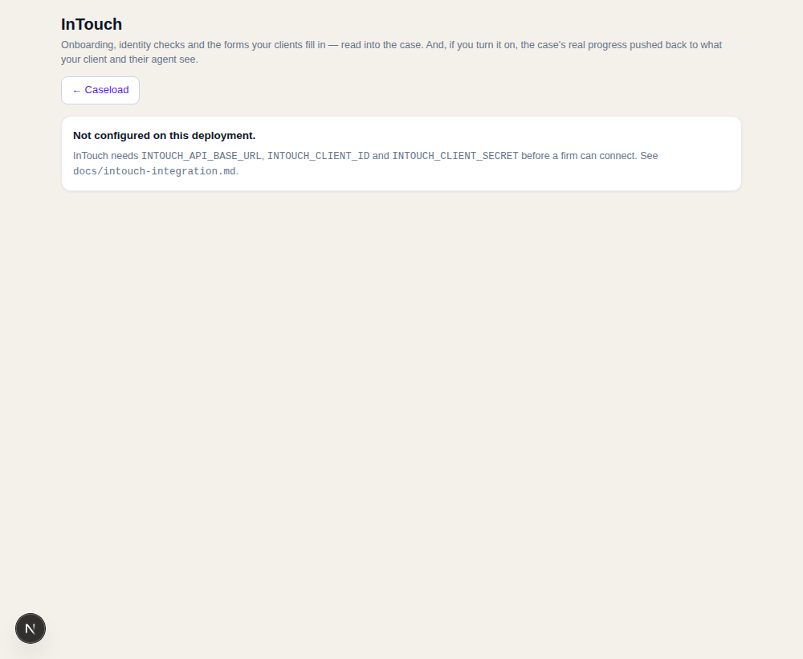

# InTouch

LEAP is where a firm's **matters** live. InTouch is where its **clients** live: the online
onboarding pack, the identity and AML checks, the property information forms the seller
fills in at the kitchen table, and the portal where the client and their estate agent
watch the case move.

CONVEYi is neither of those. It is where the case is *reasoned about*. So the InTouch
connector does three things and refuses to do a fourth.

## What it does

| | |
| --- | --- |
| **Intake** | A new instruction in InTouch becomes a mirrored matter with its parties. A *quote* is not an instruction and is skipped — a firm's pipeline is not its caseload. |
| **Facts the client produced** | A completed identity check becomes typed ID facts. A completed TA6/TA7/TA10/TA13 becomes a document and `property_forms_received`, with the client's own answers quoted as disclosures. Anything else they upload is mirrored and handed to the ordinary ingest. |
| **The truth, back out** | The engine knows where the case actually is. With milestones on, that is pushed to InTouch so the client and the agent see it without anyone retyping it. |

## What it refuses to do

**Decide anything.** An identity check that comes back `refer` does not become a
judgement here. It becomes the same flagged decision a conveyancer would get from any
other provider, cited to the report, waiting for a person. An outcome the system does not
recognise is never read as a pass: it becomes a `refer` at zero confidence with a flag
saying so in as many words.

Everything from InTouch goes through the engine's ordinary front door, as commands a
person could have typed. There is no side entrance.

## The shape

```
InTouch case (instructed / active)  ──► mirror matter row ──► a person enrols it
parties on the case                 ──► matter_contact rows, roles normalised
a completed identity check          ──► request recorded (external) ──► id_check_result
a completed TA6/TA7/TA10/TA13       ──► document + property_forms_received + disclosures
anything else the client uploaded   ──► document row ──► the ordinary ingest path
the engine's lifecycle              ──► one milestone on the client portal
```

Two triggers feed the same functions — **webhooks** (InTouch tells us) and **polling**
every 15 minutes with a watermark (we ask what changed) — because per-resource webhook
coverage is one of the things the gated reference has to confirm. Both are idempotent:
every fact is keyed on InTouch's own id in `intouch_applied`, so a fact lands exactly
once however many times a webhook fires or a sync re-reads the case.

## Details worth knowing

**The identity check nobody asked for.** The firm ordered the check *in InTouch*, so the
engine has no request open when the result arrives. The sync records the request first,
as `external`, naming InTouch as the provider — a result for a check nobody asked for
would be a hole in the log. Where the engine's ID check is already resolved, a second
result is filed as evidence and never replayed over a conclusion a person reached.

**A TA6 on a purchase.** Property forms are the seller's side, and the machine is right to
refuse one on a purchase. That is a **skip with a reason**, not an error: a firm's sync
summary should go red for faults, not for the engine doing its job. The form is left
unseen, so it lands by itself if the matter is later enrolled as the transaction it is.

**Milestones are off until the firm says otherwise.** Reading from InTouch is harmless.
Writing to something a client sees is not. Milestones are off per connection until an
admin turns them on, and even then they only ever move **forwards**, never twice for the
same step, never for a matter in shadow mode, and never for one the engine has not been
asked to run. A client watching their case go backwards loses confidence in everything
else on the page.

The engine's lifecycle is deliberately flattened for the portal — a client does not need
"contract review" and "pre-exchange" as separate facts. Sending the report on title wins
over the phase it happened in, because it is the most reassuring thing a client can see.
A closed or aborted matter says **nothing**: a client portal is not where someone should
learn their purchase fell through.

**Bytes are kept.** A decision must be able to show a client's own document, and InTouch
is not guaranteed to still hold it when someone opens the panel next year.

## What is assumed, and where to fix it

InTouch's API reference is behind developer registration and was not readable from the
build environment — the same position LEAP was in (docs/leap-integration.md). Everything
provider-specific is therefore isolated:

| Assumption | File | Confirm against the reference |
| --- | --- | --- |
| OAuth grant (client-credentials by default), token path | `endpoints.ts`, `client.ts` | which grant, token path, audience, whether a user must consent |
| `x-api-key` on every request | `endpoints.ts` | header name, and whether the key rides the token request too |
| Resource paths: `/cases`, `/cases/{id}/parties\|documents\|forms\|identity-checks\|milestones` | `endpoints.ts` | exact paths and verbs; whether milestones are writable |
| Identity outcome values, flag shape | `mapping.ts` | the real vocabulary — the unknown-outcome guard stays either way |
| Form slugs → TA6/TA7/TA10/TA13/LPE1 | `endpoints.ts` (`INTOUCH_FORM_CODES`) | the real slugs |
| Pagination (`limit` + `cursor`/`offset`, `updatedSince`), list envelopes | `client.ts` (`page()`) | parameter names and envelope |
| Milestone vocabulary | `endpoints.ts` (`INTOUCH_MILESTONES`) | what the portal actually displays |
| Webhook events, HMAC-SHA256 in `x-intouch-signature` | `endpoints.ts`, `client.ts` | event names, signature scheme, which resources emit |
| Hosts | env (`INTOUCH_API_BASE_URL`, `INTOUCH_AUTH_BASE_URL`) | none invented |

`mock.ts` serves exactly that map, and the tests drive the **real** HTTP client against
it — token refresh, retry and backoff, paging, downloads, webhook signatures, the mapping
seam. When the reference opens, the same tests re-run against InTouch and a disagreement
shows up as a mapping fix, not a rewrite.

## Configuration

Each firm connects its own InTouch account. An admin enters the firm's details at
**/conveyi/integrations/intouch**:

```
InTouch API address   the firm's region host
Client ID / secret    the firm's own credentials, issued by InTouch
API key               optional, if the firm is issued one
Webhook secret        optional; an unsigned webhook is refused when this is set
Sign-in address       optional; defaults to the API address
```

They are stored encrypted against the firm (`intouch_connection.credentials_enc`,
migration 078). A secret left blank on a later edit keeps the one already saved. If
InTouch refuses them, the page says so and keeps what was typed.

The `INTOUCH_*` env vars (`INTOUCH_API_BASE_URL`, `INTOUCH_AUTH_BASE_URL`,
`INTOUCH_CLIENT_ID`, `INTOUCH_CLIENT_SECRET`, `INTOUCH_API_KEY`, `INTOUCH_WEBHOOK_SECRET`)
are only a fallback for a deployment that serves one firm. `INTOUCH_GRANT`
(`client_credentials` by default, or `authorization_code`) stays deployment-wide.

The same page carries the milestone switch and what has come across. Disconnecting stops all reading and all
pushing at once; what is already mirrored stays on the matter, because it is the firm's
own case file.


