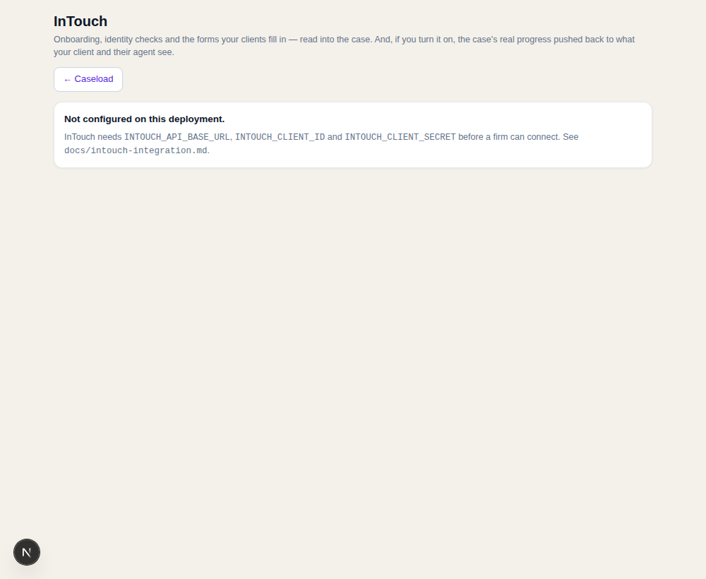

# InTouch

LEAP is where a firm's **matters** live. InTouch is where its **clients** live: the online
onboarding pack, the identity and AML checks, the property information forms the seller
fills in at the kitchen table, and the portal where the client and their estate agent
watch the case move.

CONVEYi is neither of those. It is where the case is *reasoned about*. So the InTouch
connector does three things and refuses to do a fourth.

## What it does

| | |
| --- | --- |
| **Intake** | A new instruction in InTouch becomes a mirrored matter with its parties. A *quote* is not an instruction and is skipped — a firm's pipeline is not its caseload. |
| **Facts the client produced** | A completed identity check becomes typed ID facts. A completed TA6/TA7/TA10/TA13 becomes a document and `property_forms_received`, with the client's own answers quoted as disclosures. Anything else they upload is mirrored and handed to the ordinary ingest. |
| **The truth, back out** | The engine knows where the case actually is. With milestones on, that is pushed to InTouch so the client and the agent see it without anyone retyping it. |

## What it refuses to do

**Decide anything.** An identity check that comes back `refer` does not become a
judgement here. It becomes the same flagged decision a conveyancer would get from any
other provider, cited to the report, waiting for a person. An outcome the system does not
recognise is never read as a pass: it becomes a `refer` at zero confidence with a flag
saying so in as many words.

Everything from InTouch goes through the engine's ordinary front door, as commands a
person could have typed. There is no side entrance.

## The shape

```
InTouch case (instructed / active)  ──► mirror matter row ──► a person enrols it
parties on the case                 ──► matter_contact rows, roles normalised
a completed identity check          ──► request recorded (external) ──► id_check_result
a completed TA6/TA7/TA10/TA13       ──► document + property_forms_received + disclosures
anything else the client uploaded   ──► document row ──► the ordinary ingest path
the engine's lifecycle              ──► one milestone on the client portal
```

Two triggers feed the same functions — **webhooks** (InTouch tells us) and **polling**
every 15 minutes with a watermark (we ask what changed) — because InTouch's webhooks only
cover three events and their payload does not reliably say which case they are about.
Both are idempotent: every fact is keyed on InTouch's own id in `intouch_applied`, so a
fact lands exactly once however many times a webhook fires or a sync re-reads the case.

## What InTouch documents

From InTouch's public help centre (help.intouch.cloud, checked 2026-09). The full endpoint
reference is inside the customer's InTouch account and is not public.

- **Plan.** The API and webhooks are on the **Premium and Enterprise** plans only. A firm
  on a lower plan cannot connect.
- **Auth.** A static API key the firm generates in InTouch under **Settings > API**
  ("Keys"), sent on every request in the `x-intouch-o-token` header, over HTTPS only.
  There is no OAuth: no client id, no secret, no token to refresh.
- **Parsing.** InTouch asks integrators to parse permissively and ignore attributes they
  do not know; `mapping.ts` already reads every field defensively.
- **Availability.** No uptime guarantee. The client retries network errors, 429 and 5xx
  with backoff; a 401/403 is never retried (the key was refused).
- **Webhooks are set up in the InTouch UI**, not through the API: **Settings > API >
  Webhooks**, "Add Webhook" with a URL, picking which forms count for Form Completion.
  There is no API to subscribe.
- **Events:** Form Completion, Matter State Change, Task State Change.
- **Payload.** Form Completion is documented as a flat envelope, keys with literal dots:

  ```json
  { "event": "Form_Completion",
    "triggered.by.name": "…", "triggered.by.email": "…",
    "timestamp": "2020-01-03T17:01:23Z",
    "data": { "…the form's fields…": "…" } }
  ```

  It carries **no documented case id**. The other two events' payloads are not documented;
  we assume the same envelope (`Matter_State_Change`, `Task_State_Change`).
- **Delivery.** Not signed. Retried at +10 minutes, +60 minutes, +180 minutes and +24 hours
  until a 2xx. Dates are UTC ISO 8601.

## Webhooks

Because InTouch does not sign deliveries, each firm gets its **own webhook URL** carrying
a secret:

```
https://<app>/api/v1/integrations/intouch/webhook?firm=<tenant id>&key=<webhook key>
```

The key is 32 random bytes we generate the first time the firm saves its InTouch details,
stored encrypted with them, and kept across reconnects. The route compares it in constant
time and refuses anything else with a 401 before reading the body. Once connected, the
InTouch page shows the URL with a Copy button; the admin adds it in InTouch under
**Settings > API** for Form Completion, Matter State Change and Task State Change.

What each event does (the body is a pointer; the case is always re-read from InTouch):

| Event | Does |
| --- | --- |
| Matter State Change | mirrors the matter and its parties (as a sync would), then its facts |
| Form Completion | re-reads the mirrored matter's ID checks, forms and documents |
| Task State Change | the same |
| anything else | skipped |

**Finding the case.** A case id is read from `data` where InTouch includes one
(`matterId`, `matter.id`, `caseId`, `case.id`; a matter event's own `id`). When there is
none, the envelope's `triggered.by.email` is matched against contacts: only if that person
is on **exactly one** open InTouch-mirrored matter of the firm (and is not one of the
firm's own users) is the event applied to it. Otherwise it is skipped and the next poll
picks the change up. Never a guess across several matters.

**Answers.** Once authenticated, the route always answers 2xx — even for a skip — because
a skip will not change on retry. A sync that throws answers 500, so InTouch's retry
schedule re-delivers it. There is no delivery id; the event id is the SHA-256 of the raw
body, which InTouch's retries repeat.

## Details worth knowing

**The identity check nobody asked for.** The firm ordered the check *in InTouch*, so the
engine has no request open when the result arrives. The sync records the request first,
as `external`, naming InTouch as the provider — a result for a check nobody asked for
would be a hole in the log. Where the engine's ID check is already resolved, a second
result is filed as evidence and never replayed over a conclusion a person reached.

**A TA6 on a purchase.** Property forms are the seller's side, and the machine is right to
refuse one on a purchase. That is a **skip with a reason**, not an error: a firm's sync
summary should go red for faults, not for the engine doing its job. The form is left
unseen, so it lands by itself if the matter is later enrolled as the transaction it is.

**Milestones are off until the firm says otherwise.** Reading from InTouch is harmless.
Writing to something a client sees is not. Milestones are off per connection until an
admin turns them on, and even then they only ever move **forwards**, never twice for the
same step, never for a matter in shadow mode, and never for one the engine has not been
asked to run. A client watching their case go backwards loses confidence in everything
else on the page.

The engine's lifecycle is deliberately flattened for the portal — a client does not need
"contract review" and "pre-exchange" as separate facts. Sending the report on title wins
over the phase it happened in, because it is the most reassuring thing a client can see.
A closed or aborted matter says **nothing**: a client portal is not where someone should
learn their purchase fell through.

**Bytes are kept.** A decision must be able to show a client's own document, and InTouch
is not guaranteed to still hold it when someone opens the panel next year.

## Saving received files down (parked until InTouch API access)

Every file that lands on a case in CONVEYi is saved down into each practice system the
firm has connected: LEAP and InTouch today. That covers email attachments, the text of a
linked email, uploads, InfoTrack results, and client uploads from either portal.

- **One step, every system.** It runs after the file is saved and read, the same way the
  LEAP write-back does. It is keyed per system on our document id, so each file is written
  once to each system.
- **No echoes.** A file is never sent back to the system it came from. A client's InTouch
  upload still goes to LEAP, and a LEAP document still goes to InTouch.
- **Filed by what it was read as.** Survey, search, title, enquiry replies and so on, with
  Correspondence when the file was not classified.
- **Bytes** come from wherever CONVEYi holds them: OneDrive, or the database for a case
  with no folder.

**One decision before InTouch is built.** InTouch is what the client and the estate agent
see. Every received file must not land where they can see it: the other side's papers,
the lender's instructions and a note about a gift are for the firm. The step needs
InTouch's staff-only document area, if it has one, and it needs to know which kinds may
be shared with the client. With no staff-only area, only files the client or agent sent
themselves go to InTouch, and everything else goes to LEAP alone.

## What is assumed, and where to fix it

The auth scheme and the webhooks are now known (above). The resource paths and the base URL
are not — they are in the endpoint reference inside the firm's InTouch account. Everything
provider-specific is therefore isolated:

| Assumption | File | Confirm against the reference |
| --- | --- | --- |
| Base URL | firm settings / `INTOUCH_API_BASE_URL` | none invented |
| Resource paths: `/api/v1/account`, `/cases`, `/cases/{id}/parties\|documents\|forms\|identity-checks\|milestones` | `endpoints.ts` | exact paths and verbs; whether milestones are writable |
| Identity outcome values, flag shape | `mapping.ts` | the real vocabulary — the unknown-outcome guard stays either way |
| Form slugs → TA6/TA7/TA10/TA13/LPE1 | `endpoints.ts` (`INTOUCH_FORM_CODES`) | the real slugs |
| Pagination (`limit` + `cursor`/`offset`, `updatedSince`), list envelopes | `client.ts` (`page()`) | parameter names and envelope |
| Milestone vocabulary | `endpoints.ts` (`INTOUCH_MILESTONES`) | what the portal actually displays |
| Document upload (not in the client yet): path, multipart or JSON, folder or category, and whether a document can be staff-only | `endpoints.ts`, `client.ts` | needed for saving received files down |
| Matter/Task State Change payloads, and where a case id sits in `data` | `mapping.ts` (`toWebhookEvent`) | only Form Completion is documented |

`mock.ts` serves exactly that map and checks the `x-intouch-o-token` header (401 without
it), and the tests drive the **real** HTTP client against it — the key header, retry and
backoff, paging, downloads, the documented webhook envelope, the mapping seam. When the
reference opens, the same tests re-run against InTouch and a disagreement shows up as a
mapping fix, not a rewrite.

### Ask InTouch / the firm

- The **base URL** for the firm's API (per region or per firm?).
- **Access to the endpoint reference** inside the firm's account (or a copy).
- Whether webhooks **can be signed** (a secret or HMAC header), so the URL key can become
  a second factor rather than the only one.
- Whether webhook payloads carry the **matter/case id**, and the payloads for Matter State
  Change and Task State Change.
- The **case, party, form, ID-check and document** endpoints, their fields and pagination.
- Whether **milestones** (or the portal's case status) can be **written back**, and the
  vocabulary the portal shows.
- Whether there is a **staff-only document area** (see "Saving received files down").

## Configuration

Each firm connects its own InTouch account (Premium or Enterprise plan). An admin enters
at **/conveyi/integrations/intouch**:

```
API Address   the firm's InTouch API host (https only)
API Key       generated in InTouch under Settings > API
```

They are stored encrypted against the firm (`intouch_connection.credentials_enc`,
migration 078), with the webhook key we generate. A key left blank on a later edit keeps
the one already saved. **Connect** reads the account back to prove the key; only that
marks the firm connected. If InTouch refuses, the page says so in plain terms and keeps
what was typed. A row saved in the old OAuth shape (no API key) reads as not connected.

`INTOUCH_API_BASE_URL` and `INTOUCH_API_TOKEN` are only a fallback for a deployment that
serves one firm; the webhook URL still needs the firm to press Connect once so a key is
issued.

The same page carries the webhook URL, the milestone switch and what has come across.
Disconnecting stops all reading and all pushing at once; the saved address and keys stay
so reconnecting is one click, and what is already mirrored stays on the matter, because it
is the firm's own case file.


