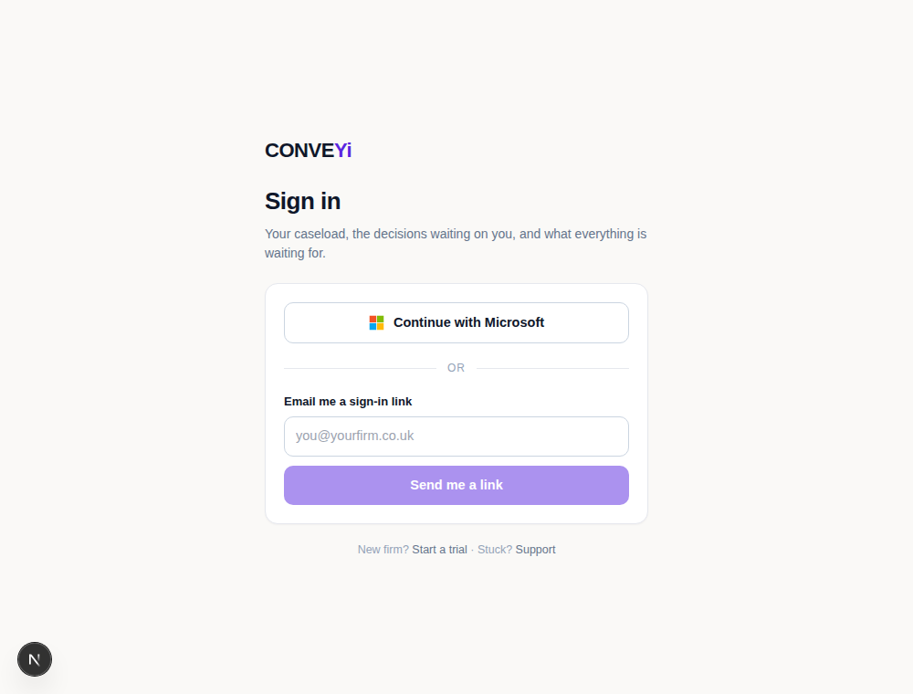
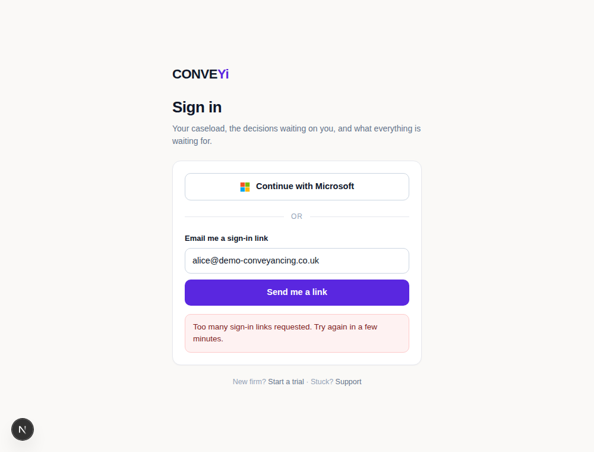

# Getting in

For a long time the answer to "how does a conveyancer sign in?" was: they don't. They open
Outlook, the add-in is already authenticated, and that is that. Two things broke that
assumption:

1. **The UI is no longer Outlook.** The caseload map, Today, the decision panel — these are
   web pages a conveyancer opens in a browser, often on a second screen while Outlook sits
   on the first.
2. **A firm is no longer necessarily a Microsoft 365 firm.** A LEAP firm may run on
   anything. A locum covering a fortnight may have no account in the firm's tenant at all.

And the behaviour in between was the worst of both: an unauthenticated visitor to `/cases`
got the page rendered, its first API call came back `401`, and the screen simply read
**Unauthenticated** — with no sign-in button, no link, nothing. A dead end.

## Where the app lives

The conveyancer's app sits under **`/conveyi`**, with the rest of the product:

| | |
| --- | --- |
| `/conveyi/cases` | the caseload map |
| `/conveyi/my-work` | DO / WAITING / CHASE / ESCALATE |
| `/conveyi/decisions`, `/conveyi/decisions/{id}` | the queue and the decision panel |
| `/conveyi/engine/{matterId}` | one matter |
| `/conveyi/account`, `/conveyi/admin`, `/conveyi/integrations/leap` | settings |
| `/conveyi/sign-in` | the way in |

These used to be at the root (`/cases`, `/decisions/{id}`). `next.config.ts` redirects the
old paths permanently, which matters more than it looks: decision links were written into
LEAP tasks and file notes months ago, and those have to keep working forever.

Every URL is built from **`lib/paths.ts`**. Nothing hardcodes a path — not the pages, not
the middleware, not the LEAP write-back, not the emails. Moving the app again should be a
one-line change there.

## The wall

`middleware.ts` runs at the edge, before anything renders. No valid session cookie on a
protected path → redirect to `/conveyi/sign-in?next=<where they were going>`. After signing
in they land on the page they asked for, not on a generic home screen.

Two things about it are deliberate:

* **The protected list is explicit** (`PROTECTED_SEGMENTS`), not a prefix match on
  `/conveyi`. `/conveyi/pricing` and `/conveyi/support` are marketing and must stay public;
  a new marketing page can never accidentally end up behind the wall, and a new app section
  is a one-word addition.
* **It is a gate, not the authorisation.** It only proves the cookie is a session this
  server signed. Every route still loads the user, checks their role and their access to
  the matter, and the database still enforces the ethical wall. Middleware failing open
  would not change what the API allows.

API routes are left out of the matcher: a `fetch` wants a status, not a redirect to HTML.
They answer `401` as they always did, and the client's `api()` helper turns that into a
trip to sign-in — which is what catches a session expiring while a page is open.

## Two doors

**Continue with Microsoft** — unchanged, and still how a new firm arrives, because that is
what provisions the tenant.

**A link in your email** — for everyone else. Type your address, get a one-time link, click
it, you are in.

```
POST /api/v1/auth/sign-in-link          →  always {"accepted": true}
GET  /api/v1/auth/sign-in-link/verify   →  session cookie + redirect to ?next
```

What makes that safe:

* **Only the hash is stored.** The link in the email is the only secret; a leaked database
  row cannot be replayed into a session.
* **Single use, 15 minutes.** The redemption claims the row (`update … where used_at is
  null returning id`) and only accepts the claim it won, so two clicks race safely.
* **It signs in an existing user only.** There is no "sign up by email" here — new firms
  come through Microsoft, colleagues through an invite. This is the way back *in*.
* **No account enumeration.** An address we do not know gets exactly the same response as
  one we do, and no email. Telling a stranger "no such user" for a conveyancer's address
  would leak which firms are clients.
* **Rate limited** per address (5) and per IP (20) in a 15-minute window, counted from the
  table rather than held in memory — there is more than one serverless instance. The limit
  is checked *before* the user lookup, so the timing does not leak either.

In development with no mail provider configured, the API returns the link in `devLink` so
the flow can be walked without Resend. That branch is `NODE_ENV === 'development'` only.

## What is deliberately not here

* **No passwords.** Storing credentials for law firms means owning hashing, resets,
  lockout, and the breach. A link in the inbox is the same security with none of that.
* **No "sign in with LEAP".** Reusing the LEAP OAuth connection as an identity provider is
  attractive for LEAP firms, but LEAP's API reference was registration-gated when this was
  built and it is not yet confirmed that it exposes user identity. Worth revisiting once
  we are through the developer portal.

## What it looks like




